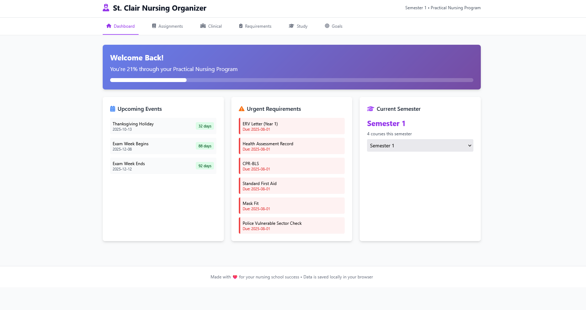
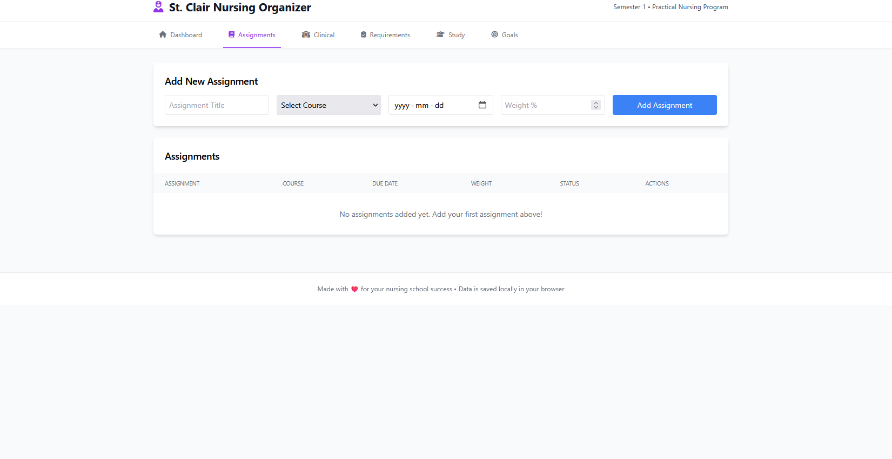
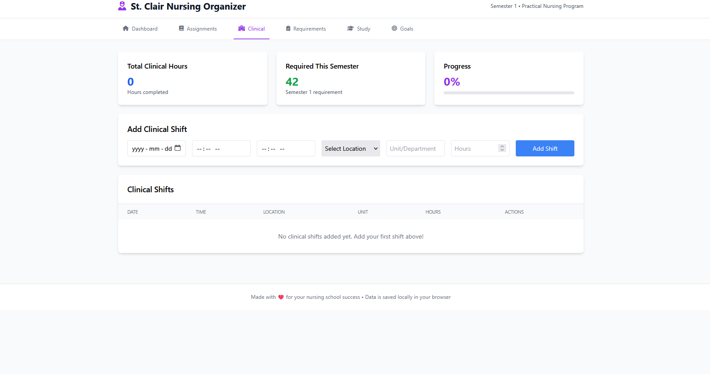
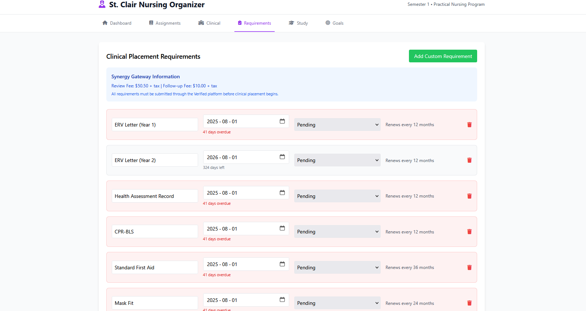
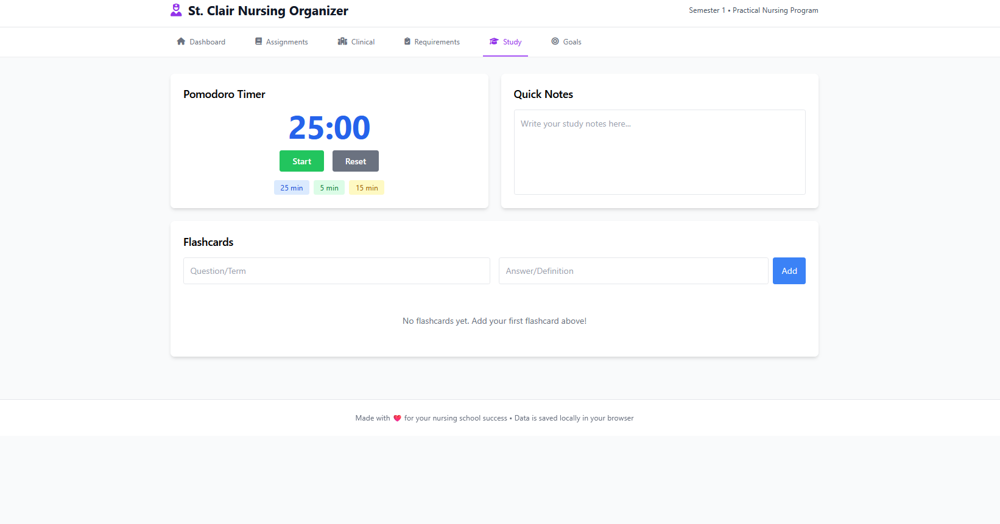
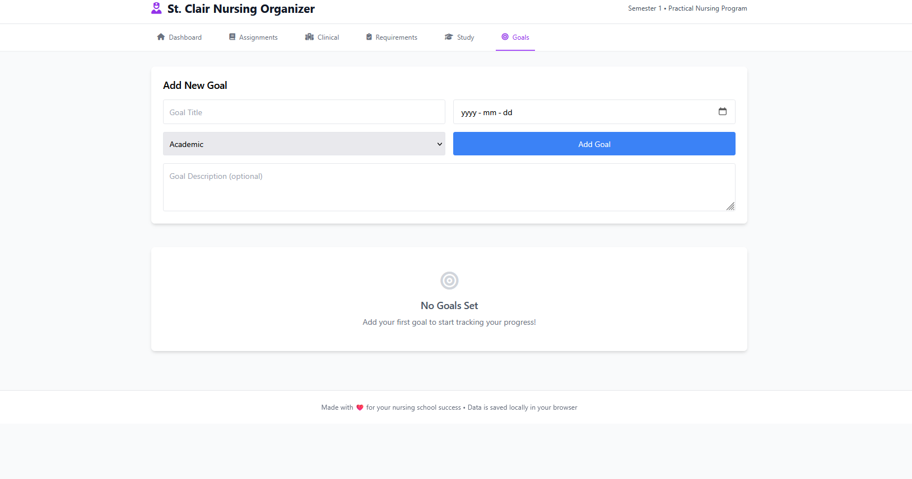

# Nursing School Organizer

A comprehensive web application for nursing students with AI-powered test generation, study tracking, and organizational tools.

## Quick Setup Guide

### 1. Install System Dependencies
```bash
# Install FFmpeg (required for audio transcription)
sudo apt update && sudo apt install -y ffmpeg

# Or on macOS:
brew install ffmpeg

# Or on Windows: Download from https://ffmpeg.org/download.html
```

### 2. Install Python Dependencies
```bash
pip install Flask==2.3.3 Flask-CORS==4.0.0 python-dotenv==1.0.0 requests==2.31.0 PyPDF2==3.0.1 python-docx==1.1.0 python-pptx==1.0.2 ollama==0.3.3 pywhispercpp==1.3.3
```

### 3. Configure Ollama Cloud API (for AI Test Generation & Audio Enhancement)
Create a `.env` file with your Ollama Cloud credentials:
```env
OLLAMA_HOST=https://ollama.com
OLLAMA_API_KEY=your_api_key_here
OLLAMA_MODEL=gpt-oss:120b-cloud
```

### 4. Run the Backend Server
```bash
python app.py
```

The server will start on `http://localhost:5008`

### 5. Open the Frontend
Open `database_enabled_frontend.html` in your browser. The app will automatically:
- Connect to the database
- Initialize with default St. Clair requirements
- Sync all data across browsers and devices

## Features

### 🎙️ Audio-to-Notes (NEW!)
- **Live Recording**: Record lectures directly in your browser with pause/resume controls
- **File Upload**: Upload audio files (MP3, WAV, M4A, WEBM, OGG, FLAC up to 200MB)
- **AI Transcription**: Automatic speech-to-text using Whisper.cpp with GPU acceleration
- **AI Enhancement**: Clean up transcripts with proper formatting, markdown, and punctuation
- **Audio Playback**: Listen to original recordings while reading transcripts
- **Library Management**: Organize all your audio notes with search and filtering
- **Rich Formatting**: Enhanced notes with bold text, headings, code blocks, and lists
- **Mobile-Friendly**: Record and transcribe on any device

### 🤖 AI-Powered Test Generation
- **Smart Document Upload**: Upload PDF, DOCX, PPTX, TXT, or MD files (up to 200MB)
- **Custom Test Creation**: Generate practice tests with custom instructions
- **Two Test Modes**:
  - **Practice Mode**: Get instant feedback after each question, resume anytime
  - **Exam Mode**: No feedback until completion, optional timer, single session
- **Progress Tracking**: Visual feedback with color-coded question navigator (green=correct, red=incorrect)
- **Save & Resume**: All practice tests auto-save progress and can be resumed later
- **Analytics Dashboard**: Track scores over time, identify weak areas, view performance by question
- **Test Library**: Save unlimited tests with custom titles, view history and best scores

### 📊 Study Organization
- **Dashboard**: Progress tracking through 5-semester program, upcoming events
- **Assignment Tracker**: Due dates, weights, status indicators, automatic urgency calculations
- **Clinical Tracker**: Log shifts, track hours, visualize progress against requirements
- **Requirements Tracker**: Pre-loaded St. Clair Synergy Gateway requirements with deadline tracking
- **Goals Tracker**: Academic, clinical, personal, and career goals with progress visualization
- **Grades Tracker**: Record assessments, calculate course averages
- **Wellness Tracker**: Track stress levels, mood, study/sleep hours

### 🗄️ Database Features
- **Cross-Browser Persistence**: Access data from any browser or device
- **Backup/Restore**: Built-in data export functionality
- **Data Integrity**: SQLite database ensures consistency
- **Real-time Sync**: All changes saved instantly

## File Structure
```
nursing WebApp/
├── app.py                          # Flask backend server
├── database_enabled_frontend.html  # Main frontend application
├── .env                            # Ollama Cloud API credentials
├── data/
│   └── nursing_app.db              # SQLite database (auto-created)
├── audio_storage/                  # Saved audio recordings (auto-created)
├── requirements.txt                # Python dependencies
├── favicon_io/                     # Favicon files
└── README.md
```

## Usage

### Recording and Transcribing Lectures
1. Navigate to the "Audio Notes" tab
2. **To Record**:
   - Click "Record" tab
   - Click "Start Recording" and allow microphone access
   - Use Pause/Resume controls as needed
   - Click "Stop" when finished
   - Add title, course, and date information
   - Check "Enhance with AI" for formatted notes
   - Click "Transcribe & Save"
3. **To Upload**:
   - Click "Upload" tab
   - Select an audio file from your device
   - Add metadata and enhancement options
   - Click "Transcribe & Save"
4. **View & Listen**:
   - Access saved notes in the "My Notes" library
   - Click "View" to see transcript and play audio
   - Toggle between raw transcript and enhanced notes

### Creating AI-Generated Tests
1. Navigate to the "AI Test Generator" tab
2. Click "Upload Materials" and select your study files (PDF, DOCX, PPTX)
3. Add custom instructions (e.g., "100 questions covering every chapter")
4. Click "Generate Practice Test" and wait 1-3 minutes
5. Save the test to your library or take it immediately

### Taking Tests
1. **Practice Mode**: Answer questions with instant feedback, save progress anytime
2. **Exam Mode**: Timed (optional), no feedback until completion, must finish in one session
3. Use color-coded navigator to track progress (purple=current, green=correct, red=incorrect, blue=answered)
4. Click "Restart" to start over with a fresh attempt

### Viewing Analytics
1. Go to "My Tests" tab
2. Click the chart icon on any test with completed attempts
3. View score trends, question-by-question performance, and statistics

## Troubleshooting

### Port Issues
The app runs on port 5008. If busy, change in `app.py`:
```python
app.run(debug=True, host='0.0.0.0', port=5009)
```

### Audio Transcription Errors
**"FFMPEG is not installed"**:
- Install FFmpeg (see setup instructions above)
- Verify installation: `ffmpeg -version`

**Microphone not working**:
- Check browser permissions for microphone access
- Try using HTTPS or localhost (required for mic access)
- Test with different browser (Chrome/Firefox recommended)

**Transcription taking too long**:
- First run downloads Whisper model (~140MB) - this is normal
- Subsequent transcriptions are much faster
- GPU acceleration speeds up processing significantly

**Audio playback not working**:
- Browser must support HTML5 audio (webm/mp3)
- Check if audio file exists in `audio_storage/` folder

### AI Test Generation Taking Too Long
- Large files (100+ questions) may take 2-5 minutes
- Reduce question count or file size for faster generation

### Tests Not Saving
- Ensure Flask backend is running
- Check browser console for connection errors
- Verify SQLite database file exists in `data/nursing_app.db`

## Technical Details
- **Frontend**: React (via Babel), Tailwind CSS
- **Backend**: Flask (Python 3.x)
- **Database**: SQLite with 15+ tables for comprehensive data management
- **AI Engine**: Ollama Cloud API (gpt-oss:120b-cloud model)
- **Speech Recognition**: Whisper.cpp (base model) with GPU acceleration
- **Audio Processing**: FFmpeg for format conversion
- **File Processing**: Supports PDF, DOCX, PPTX, TXT, MD formats
- **Audio Formats**: MP3, WAV, M4A, WEBM, OGG, FLAC
- **Max Upload Size**: 200MB per request

## Recent Updates

### Audio-to-Notes Feature (Latest)
- ✅ Live lecture recording with browser microphone
- ✅ Audio file upload support (multiple formats)
- ✅ Whisper.cpp integration for accurate transcription
- ✅ AI-powered transcript enhancement with markdown formatting
- ✅ Audio playback while reading transcripts
- ✅ Beautiful rich-text rendering with code highlighting
- ✅ Mobile-responsive audio player
- ✅ Library view with audio availability indicators

### Enhanced Test System
- ✅ Two test modes: Practice (with instant feedback) and Exam (timed, no feedback)
- ✅ Auto-save and resume for practice tests
- ✅ Comprehensive analytics dashboard with score tracking
- ✅ Question-by-question performance analysis
- ✅ Visual progress indicators with color-coded feedback
- ✅ Test library with unlimited saved tests
- ✅ Restart functionality with confirmation
- ✅ Fixed answer parsing for markdown-formatted solutions

## Screenshots







